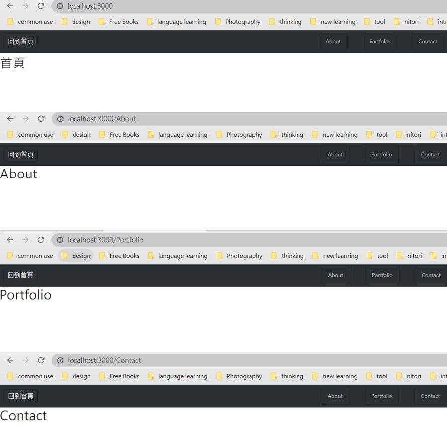

# practice_router



## 介紹

具備切換4個頁面功能的簡易網頁。

### 功能

- 具備首頁、About、Portfolio、contact四個頁面
- 能夠在以上四個分業中自由切換

## 開始

1. 請先確認有安裝 node.js 與 npm
2. 將專案 clone 至本地端
3. 透過終端機進入資料夾，輸入：

   ```bash
   npm install
   ```

4. 安裝完畢後，繼續輸入：

   ```bash
   npm run start
   ```

5. 若看見此行訊息則代表順利運行

   ```bash
   Express is listening on localhost:3000
   ```

6. 打開瀏覽器進入到以下網址

   ```bash
   localhost:3000
   ```
7. 若欲暫停使用

   ```bash
   ctrl + c
   ```

## 開發工具

- Node.js 4.16.0
- Express 4.16.4
- Express-Handlebars 3.0.0
- Bootstrap 5.3.0
